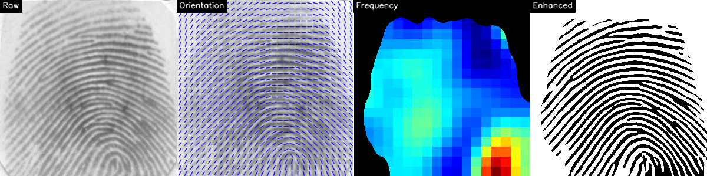
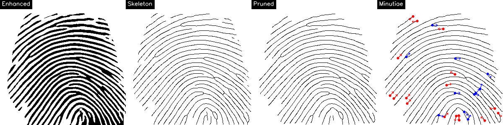
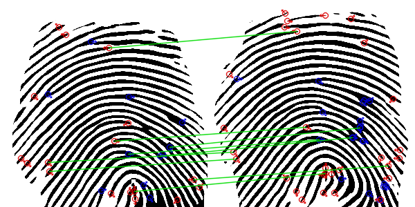
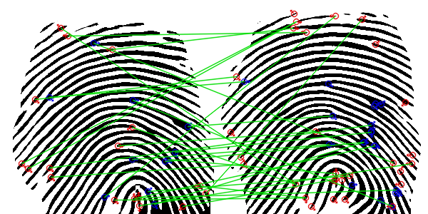

# Fingerprint Recognition

A minutiae-based fingerprint recognition system implementing classical image processing and modern descriptor matching, built to learn C++17, CMake, and OpenCV.

---

## Pipeline

```text
Raw Image → Enhancement → Minutiae Detection → Descriptor Extraction → Matching → Score
```

---

## Enhancement

Transforms a raw fingerprint image into a clean, binarized ridge map through five stages:

1. **Normalize** — adjust mean and variance across the image
2. **Ridge Orientation** — estimate local ridge direction per block (block size: 10 px)
3. **Ridge Frequency** — estimate ridge period per block (range: 3–25 px)
4. **ROI Extraction** — mask out background regions
5. **Gabor Filter** — apply bank of oriented Gabor filters tuned to local frequency and orientation


*Left to right: raw image · orientation map · frequency map · enhanced binary*

---

## Minutiae Detection

Operates on the thinned binary image to find and classify ridge features.

1. **Skeletonize** — reduce binary ridges to 1-px skeleton
2. **Classify** — count 8-connected neighbors: 1 neighbor → ridge ending, 3+ neighbors → bifurcation
3. **Prune** — remove spurious minutiae: spurs (≤9 px), lakes (area ≤150 px²), islands (size ≤30 px)


*Red = ridge endings · Blue = bifurcations · Arrows indicate ridge direction*

---

## MCC Descriptor

Each minutia is encoded as a **Minutia Cylinder-Code (MCC)**: a 384-bit binary descriptor capturing the spatial and angular neighborhood.

- **Grid**: 8×8 spatial cells over radius R = 70 px
- **Angular bins**: 6 direction bins (ND = 6)
- **Total bits**: NS × NS × ND = 8 × 8 × 6 = 384 bits
- **Spatial sigma**: σ_S = 10.0 px; **Direction sigma**: σ_D = 0.8 rad

---

## Matching

Two matching strategies are implemented:

| Strategy | Description |
| --- | --- |
| **Alignment Matcher** | Votes over candidate alignments; counts minutiae pairs within spatial (10 px) and angular (0.35 rad) tolerance |
| **MCC + LSS** | Local Similarity Sort — for each descriptor in set A, finds max similarity in set B via bitwise Jaccard comparison; averages over `max(\|A\|, \|B\|)` |

**Alignment Matcher** — geometrically consistent matches, sparse and well-localized:



**MCC + LSS** — greedy nearest-neighbor in descriptor space; each minutia in A is connected to its closest match in B regardless of geometry:



---

## Results

Evaluated on 10 subjects × 8 impressions (280 genuine pairs, 45 impostor pairs).

| Matcher | EER |
| --- | --- |
| Alignment Matcher | 19.6% |
| MCC + LSS | 31.1% |

---

## Project Structure

```text
.
├── include/fingerprint/
│   ├── core/           # Core types (Minutia, EnhancementResult, MatchedPair)
│   ├── enhancement/    # Enhancer class and EnhancerParams
│   └── features/       # Detector, MCCExtractor, LSSMatcher, AlignmentMatcher
├── src/
│   ├── core/           # orientation, frequency, gabor, roi, skeleton, pruning, minutiae
│   ├── enhancement/    # enhancement.cpp
│   └── features/       # detection.cpp, mcc.cpp, visualization.cpp
├── app/
│   ├── match_fp.cpp        # Demo: alignment matcher
│   ├── match_fp_mcc.cpp    # Demo: MCC + LSS matcher
│   ├── enhance_all.cpp     # Batch enhance data/raw/ → data/enhanced/
│   └── generate_vis.cpp    # Generate vis/ images for the README
├── test/
│   ├── eval.cpp            # EER evaluation (alignment)
│   └── eval_mcc.cpp        # EER evaluation (MCC + LSS)
└── data/
    ├── raw/            # 80 raw TIFF images (101_1.tif … 110_8.tif)
    └── enhanced/       # Pre-computed enhanced images
```

---

## Building & Running

**Prerequisites:** CMake ≥ 3.16, Ninja, OpenCV

```bash
# Configure
cmake --preset debug     # enables FP_DEBUG_VIS (imshow windows)
cmake --preset release

# Build
cmake --build build/release

# Run demos (matches data/raw/104_3.tif vs 104_7.tif)
./build/release/fingerprint_app        # Alignment matcher
./build/release/fingerprint_app_mcc   # MCC + LSS matcher

# Regenerate vis/ images
./build/release/generate_vis

# EER evaluation
./build/release/test/eval
./build/release/test/eval_mcc
```

> The `debug` preset sets `ENABLE_DEBUG_VIS=ON`, compiling in `cv::imshow` calls via the `FP_DEBUG_VIS` macro.

---

## Dataset

80 TIFF fingerprint images: 10 subjects (IDs 101–110), 8 impressions each.

Naming convention: `{subject_id}_{impression}.tif` — e.g. `104_3.tif` is subject 104, impression 3.

---

## Key Parameters

| Group | Parameter | Value |
| --- | --- | --- |
| **Enhancement** | Normalization target mean / std | 100 / 100 |
| | Orientation block size | 10 px |
| | Frequency block size | 16 px |
| | Frequency range | 3–25 px (period) |
| | Gabor filter size | 11 px, angle step 3° |
| **Detection** | Spur max length | 9 px |
| | Lake max area | 150 px² |
| | Island min size | 30 px |
| | Border margin | 10 px |
| **MCC** | Spatial grid (NS) | 8 × 8 |
| | Angular bins (ND) | 6 |
| | Cylinder radius (R) | 70 px |
| | Spatial sigma | 10.0 px |
| **Alignment** | Spatial tolerance | 10 px |
| | Angular tolerance | 0.35 rad (~20°) |

---

## Known Limitations & To-Do

| # | Area | Issue |
| --- | --- | --- |
| 1 | **Bifurcation direction** | The stem branch is identified as whichever branch best aligns with the local ridge orientation map, and the bifurcation angle is set to the unit-vector bisector of the remaining fork branches. This means correctness depends on the orientation map being reliable at that pixel, and the bisector of two diverging branches is often not a perceptually meaningful ridge direction. This degrades MCC descriptor quality because the angular neighborhood encoding is sensitive to the reference orientation of each minutia. |
| 2 | **Minutiae pruning** | The current strategy (spur removal + border/mask distance thresholds) is coarse. There is no density-based pruning, no quality-weighted selection, and no global limit on minutiae count — low-quality images produce far too many or far too few minutiae without further filtering. |
| 3 | **LSS matching (no global constraint)** | Local Similarity Sort is a greedy, one-to-one nearest-neighbor search in descriptor space. It enforces no geometric consistency: a minutia in A may be matched to a descriptor in B that is spatially inconsistent with other matches. This makes the score sensitive to spurious descriptors and contributes to the higher EER relative to the alignment-based matcher. |

---

## References

- Lin Hong, Yifei Wan, and Anil Jain, "Fingerprint Image Enhancement: Algorithm and Performance Evaluation," *IEEE Transactions on Pattern Analysis and Machine Intelligence*, vol. 20, no. 8, pp. 777–789, 1998.
